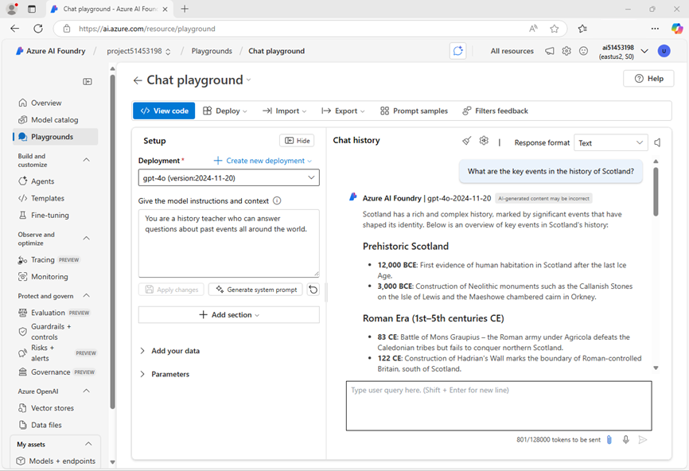

---
lab:
  title: 准备实施 AI 开发项目
  description: 了解如何在中心和项目中组织云资源，以便开发人员在生成 AI 解决方案时取得成功。
---

# 准备实施 AI 开发项目

在本练习中，你将使用 Azure AI Foundry 门户创建项目，准备生成 AI 解决方案。

此练习大约需要 **30** 分钟。

> **注意**：本练习中使用的一些技术处于预览版或积极开发阶段。 可能会遇到一些意想不到的行为、警告或错误。

## 打开 Azure AI Foundry 门户

首先登录到 Azure AI Foundry 门户。

1. 在 Web 浏览器中打开 [Azure AI Foundry 门户](https://ai.azure.com)，网址为：`https://ai.azure.com`，然后使用 Azure 凭据登录。 关闭首次登录时打开的任何使用技巧或快速入门窗格，如有必要，使用左上角的 **Azure AI Foundry** 徽标导航到主页，类似下图所示（若已打开**帮助**面板，请关闭）：

    

1. 查看主页上的信息。

## 创建项目

Azure AI *项目*为 AI 开发提供协作工作区。 首先，选择要使用的模型并创建要在其中使用模型的项目。

> **备注**：AI Foundry 项目可以基于 *Azure AI Foundry* 资源，该资源提供对 AI 模型（包括 Azure OpenAI）、Azure AI 服务和其他资源的访问权限，用于开发 AI 代理和聊天解决方案。 或者，项目可以基于 *AI 中心*资源；其中包含与 Azure 资源的连接，用于安全存储、计算和专用工具。 基于 Azure AI Foundry 的项目非常适合想要管理 AI 代理或聊天应用开发的资源的开发人员。 基于 AI 中心的项目更适用于处理复杂 AI 解决方案的企业开发团队。

1. 在主页的“**浏览模型和功能**”部分中，搜索 `gpt-4o` 模型；我们将在项目中使用它。
1. 在搜索结果中，选择 **gpt-4o** 模型以查看其详细信息，然后在模型的页面顶部，选择“**使用此模型**”。
1. 当提示创建项目时，输入项目的有效名称并展开“**高级选项**”。
1. 选择“**自定义**”，并为项目指定以下设置：
    - **Azure AI Foundry 资源**：*Azure AI Foundry 资源的有效名称*
    - **订阅**：Azure 订阅
    - **资源组**：*创建或选择资源组*
    - **区域**：*选择任何**支持 AI 服务的位置***\*

    > \* 某些 Azure AI 资源受区域模型配额约束。 如果稍后在练习中达到配额限制，你可能需要在不同的区域中创建另一个资源。

1. 选择“**创建**”并等待项目（包括所选的 gpt-4 模型部署）创建。
1. 创建项目后，聊天操场将自动打开，以便可以测试模型：

    

1. 在左侧导航窗格中，选择“**概述**”以查看项目的主页；如下所示：

    > **备注**：如果显示“*权限不足*”错误，请使用“**修复我**”按钮解决此问题。

    

1. 在左侧导航窗格底部，选择“**管理中心**”。 在管理中心中，可在*资源*和*项目*级别配置设置；这两者均显示在导航窗格中。

    

    *资源*级别与为支持项目而创建的 **Azure AI Foundry** 资源相关。 此资源包含与 Azure AI 服务和 Azure AI Foundry 模型的连接；并提供一个中心位置，用于管理用户对 AI 开发项目的访问权限。

    *项目*级别与单个项目相关，可在其中添加和管理特定于项目的资源。

1. 在导航窗格的“Azure AI Foundry 资源”部分中，选择“**概述**”页以查看其详细信息。
1. 选择指向与资源关联的“**资源组**”的链接，以打开新的浏览器选项卡并导航到 Azure 门户。 如果出现提示，请使用 Azure 凭据登录。
1. 在 Azure 门户中查看资源组，以查看为支持 Azure AI Foundry 资源和项目而创建的 Azure 资源。

    

    请注意，这些资源已在创建项目时选择的区域中创建。

1. 关闭“Azure 门户”选项卡并返回到 Azure AI Foundry 门户。

## 查看项目连接

Azure AI Foundry 项目及其所属的 Azure AI Foundry 资源包含与可在 AI 应用程序中使用的资源的连接。

1. 在管理中心页的导航窗格中，在你的项目下，选择“**转到资源**”。
1. 在项目“**概述**”页中，查看“**终结点和密钥**”部分；其中包含可在应用程序代码中用于访问的终结点和授权密钥：
    - Azure AI Foundry 项目及其中部署的任何模型。
    - Azure AI Foundry 模型中的 Azure OpenAI。
    - Azure AI 服务

## 测试生成式 AI 模型

了解有关 Azure AI Foundry 项目配置的内容后，可以返回到聊天操场来浏览已部署的模型。

1. 在项目的左侧导航窗格中，选择“**操场**” 
1. 打开“**聊天操场**”，确保在“**部署**”部分中选择 **gpt-4o** 模型部署。
1. 在“设置”**** 窗格中的**授予模型说明和上下文**框中，输入以下说明：

    ```
   You are a history teacher who can answer questions about past events all around the world.
    ```

1. 应用更改以更新系统消息。
1. 在聊天窗口中输入查询，例如`What are the key events in the history of Scotland?`，然后查看回复：

    

## 总结

在本练习中，你了解了 Azure AI Foundry，并了解了如何创建和管理项目及其相关资源。

## 清理

如果已完成对 Azure AI Foundry 门户的探索，则应删除在本练习中创建的资源，以避免产生不必要的 Azure 成本。

1. 在 [Azure 门户](https://portal.azure.com) (`https://portal.azure.com`) 中，查看在其中部署了本练习中使用的资源的资源组的内容。
1. 在工具栏中，选择“删除资源组”****。
1. 输入资源组名称，并确认要删除该资源组。
