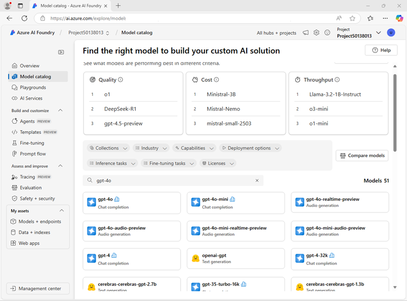

---
lab:
  title: 选择和部署语言模型
  description: 生成式 AI 应用程序基于一个或多个语言模型构建。 了解如何为生成式 AI 项目查找和选择相应的模型。
---

# 选择和部署语言模型

Azure AI Foundry 模型目录充当中央存储库，在其中可浏览和使用各种模型，从而为创建生成式 AI 方案提供便利。

在本练习中，你将探索 Azure AI Foundry 门户中的模型目录，并比较有助于解决问题的生成式 AI 应用程序的潜在模型。

该练习大约需要 **25** 分钟。

> **注意**：本练习中使用的一些技术处于预览版或积极开发阶段。 可能会遇到一些意想不到的行为、警告或错误。

## 创建 Azure AI 中心和项目

Azure AI 中心会提供协作式工作区，可在其中定义一个或多个项目。** 让我们创建项目和 Azure AI 中心。

1. 在 Web 浏览器中打开 [Azure AI Foundry 门户](https://ai.azure.com)，网址为：`https://ai.azure.com`，然后使用 Azure 凭据登录。 关闭首次登录时打开的任何使用技巧或快速入门窗格，如有必要，使用左上角的 **Azure AI Foundry** 徽标导航到主页，类似下图所示（若已打开**帮助**面板，请关闭）：

    

1. 在主页中，选择“**+ 创建项目**”。
1. 在**创建项目**向导中，输入项目的有效名，如果出现建议使用现有中心的提示，请选择新建中心的选项。 然后查看将自动创建的 Azure 资源以支持中心和项目。
1. 选择“**自定义**”并为中心指定以下设置：
    - **中心名**：*有效的中心名*
    - **订阅**：Azure 订阅
    - **资源组**：*创建或选择资源组*
    - **位置**：选择**帮助我选择**，然后在“位置帮助程序”窗口中选择**gpt-4o**，并使用推荐的区域\*
    - **连接 Azure AI 服务或 Azure OpenAI**：*新建 AI 服务资源*
    - **连接 Azure AI 搜索**：跳过连接

    > \* Azure OpenAI 资源受区域模型配额约束。 如果稍后在练习中达到配额限制，你可能需要在不同的区域中创建另一个资源。

1. 选择“**下一步**”查看配置。 然后，选择“**创建**”并等待该进程完成。
1. 创建项目后，关闭显示的所有使用技巧，并查看 Azure AI Foundry 门户中的项目页面，如下图所示：

    

## 配置 Azure AI 推理服务部署

在 Azure AI Foundry 门户中部署模型有多种选项。 在本练习中，你将使用 **Azure AI 模型推理**部署选项，该选项支持 Azure AI Foundry 模型目录中的 *Azure OpenAI* 模型和“*模型即服务*”模型。 所有模型统一部署在 Azure AI Services 资源托管的通用终结点上，测试时可以轻松地在模型之间切换，以便比较各自的行为和性能。

1. 在 Azure AI Foundry 项目页面右上角的工具栏中，使用**预览功能**图标(**&#9215;**)显示预览功能。
1. 验证是否已启用“**将模型部署到 Azure AI 模型推理服务**”功能。 然后关闭“**预览功能**”窗格。

## 查看模型详细信息和基准

为了帮助你选择模型，可以浏览模型说明和基准，以确定哪种模型最符合需求。

1. 在 Azure AI Foundry 项目门户的左侧导航窗格中，选择“**模型目录**”。
1. 在模型目录主页中，搜索 `gpt-4o`以查找**gpt-4o** 聊天完成模型。

    

1. 选择 **gpt-4o** 模型并查看其详细信息。 阅读说明并查看页面上提供的其他信息。

    

1. 在 **gpt-4o** 页面上，查看**基准**选项卡，了解模型在一些标准性能基准中与其他在类似场景中使用的模型的比较。

    

1. 使用 **gpt-4o** 页标题旁边的后退箭头（**&larr;**），返回到模型目录主页。
1. 在模型目录中，搜索 `Phi-3.5-mini-instruct` 并查看 **Phi-3.5-mini-instruct** 模型的详细信息和基准。

## 比较模型

你已查看了两个不同的模型，这两种模型都可用于实现生成式 AI 聊天应用程序。 现在，让我们直观地比较这两个模型的指标。

1. 返回“**模型目录**”主页。
1. 选择“**比较模型**”。 模型比较的可视化图表与一系列常见模型一起显示。

    

1. 在左侧的“**模型比较**”窗格中，请注意，可以选择常用任务，例如*问题解答*，以便自动为特定任务选择常用模型。
1. 使用“**清除所有模型**” (&#128465;) 图标，移除所有预先选择的模型。
1. 使用 **+ 模型比较**按钮，将 **gpt-4o** 模型添加到列表中。 然后使用同一按钮将 **Phi-3.5-mini-instruct** 模型添加到列表中。
1. 查看图表，该图表根据“**质量索引**”（指示模型质量的标准化分数）和“**成本**”比较模型。 可以通过将鼠标悬停在图表中表示它的点上来查看模型的特定值。

    

1. 在“**X 轴**”下拉菜单的“**质量**”下，选择以下指标并观察每个生成的图表，然后再切换到下一个图表：
    - 准确性
    - 一致性
    - 流畅度
    - 相关性

## 部署模型

通过模型基准探索完选项后，现在可以部署语言模型。 可以浏览模型目录并从中进行部署，也可以通过“**部署**”页部署模型。 让我们探讨这两个选项。

### 从*模型目录*部署模型

首先从模型目录部署模型。 如果要查看多个可用模型，则可以首选此选项。

1. 返回“**模型目录**”主页。
1. 搜索并选择 `gpt-4o` 模型，就像之前所做的那样。
1. 在**gpt-4o**页面，选择**部署**，在部署详细信息中选择**自定义**，并按以下设置部署模型：
1. 在部署详细信息中选择“**自定义**”，并使用以下设置部署模型：
    - **部署名**：*有效的模型部署名*
    - **部署类型**：全局标准
    - **自动版本更新**：启用
    - **模型版本**：*选择最新可用版本*
    - **连接的 AI 资源**：*选择 Azure OpenAI 资源连接*
    - **每分钟令牌限制（千令牌）**：50K *（或如果订阅的可用上限低于 50K，则以其为准）*
    - **内容筛选器**：DefaultV2

    > **注意**：减少 TPM 有助于避免过度使用正在使用的订阅中可用的配额。 50,000 TPM 足以应对本练习所需的数据处理量。 如果可用配额低于上述 50,000 TPM，你仍然可完成本练习，但超过速率限制时可能需要等待并重新提交提示。

1. 等待部署完成。

### 通过“*模型 + 终结点*”部署模型

如果已确切知道要部署的模型，则可以通过“**模型 + 终结点**”执行此操作。

1. 在左侧导航栏中的“**我的资产**”部分，选择“**模型 + 终结点**”页。
1. 在“**模型部署**”选项卡中的“**+ 部署模型**”下拉列表中，选择“**部署基础模型**”。 然后搜索 `Phi-3.5-mini-instruct` 并确认选择。
1. 同意模型许可证。
1. 使用以下设置，部署**Phi-3.5-mini-instruct**模型：
    - **部署名称**：*模型部署的有效名称*
    - **部署类型**：全局标准
    - **部署详细信息**：*使用默认设置*

1. 等待部署完成。

## 在聊天操场中测试模型

现在有两种要比较的模型，让我们看看这些模型在对话交互中的行为。

### 准备聊天

1. 在导航栏中，选择“**操场**”。 然后选择“**聊天操场**”。
1. 在“**设置**”窗格中的“**授予模型指令和上下文**”字段中，将系统提示设置为 `You are an AI assistant that helps solve problems.`
1. 选择“**应用更改**”。

### 与 *gpt-4o* 模型聊天

在“设置”**** 窗格中，选择 *gpt-4o* 模型。
1. 在查询窗口中输入以下查询

    ```
    I have a fox, a chicken, and a bag of grain that I need to take over a river in a boat. I can only take one thing at a time. If I leave the chicken and the grain unattended, the chicken will eat the grain. If I leave the fox and the chicken unattended, the fox will eat the chicken. How can I get all three things across the river without anything being eaten?
    ```

1. 查看响应 然后输入以下跟进查询：

    ```
    Explain your reasoning.
    ```

### 使用 *Phi-3.5* 模型的聊天

1. 在“**设置**”窗格中，选择 *Phi-3.5* 模型。
1. 请确保在重复之前用于测试 gpt-4 模型的相同提示之前启动新的聊天会话。
1. 在查询窗口中输入以下查询

    ```
    I have a fox, a chicken, and a bag of grain that I need to take over a river in a boat. I can only take one thing at a time. If I leave the chicken and the grain unattended, the chicken will eat the grain. If I leave the fox and the chicken unattended, the fox will eat the chicken. How can I get all three things across the river without anything being eaten?
    ```

1. 查看响应 然后输入以下跟进查询：

    ```
    Explain your reasoning.
    ```

### 执行进一步比较

1. 用两种模型尝试以下谜题，让模型解释它们的推理（正确答案是40！）：

    ```
    I have 53 socks in my drawer: 21 identical blue, 15 identical black and 17 identical red. The lights are out, and it is completely dark. How many socks must I take out to make 100 percent certain I have at least one pair of black socks?
    ```

## 反思模型

已比较了两种模型，这两种模型在生成适当的响应和成本方面可能有所不同。 在任何生成式场景中，都需要找到一种模型，既要适合你需要它执行的任务，又要满足你期望它处理的请求数量所需的使用成本。

模型目录中提供的详细信息和基准，以及直观比较模型的能力，为识别生成式 AI 解决方案的候选模型提供了一个有用的起点。 然后，可以在聊天操场中使用各种系统和用户提示测试候选模型。

## 清理

如果已完成对 Azure AI Foundry 门户的探索，则应删除在本练习中创建的资源，以避免产生不必要的 Azure 成本。

1. 打开[Azure 门户](https://portal.azure.com)并查看在其中部署了本练习中使用的资源的资源组的内容。
1. 在工具栏中，选择“删除资源组”****。
1. 输入资源组名称，并确认要删除该资源组。
