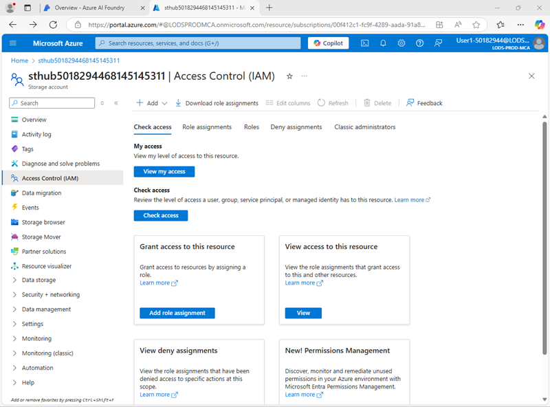

---
lab:
  title: 使用提示流管理聊天应用中的对话
  description: 了解如何使用提示流管理对话，并确保构建和编排提示以获得最佳结果。
---

## 使用提示流管理聊天应用中的对话

在本练习中，将使用 Azure AI Foundry 门户的提示流创建自定义聊天应用，使用用户提示和聊天历史记录作为输入，并使用 Azure OpenAI 中的 GPT 模型生成输出。

该练习大约需要 **30** 分钟。

> **注意**：本练习中使用的一些技术处于预览版或积极开发阶段。 可能会遇到一些意想不到的行为、警告或错误。

## Azure AI Foundry 中心和项目

我们将在本练习中使用的 Azure AI Foundry 功能，需要基于 Azure AI Foundry *中心*资源的项目。

1. 在 Web 浏览器中打开 [Azure AI Foundry 门户](https://ai.azure.com)，网址为：`https://ai.azure.com`，然后使用 Azure 凭据登录。 关闭首次登录时打开的任何使用技巧或快速入门窗格，如有必要，使用左上角的 **Azure AI Foundry** 徽标导航到主页，类似下图所示（若已打开**帮助**面板，请关闭）：

    

1. 在浏览器中，导航到 `https://ai.azure.com/managementCenter/allResources` 并选择“**创建**”。 然后选择创建新的 **AI 中心资源**的选项。
1. 在“**创建项目**”向导中，输入项目的有效名称，如果建议使用现有中心，请选择用于创建新中心的选项，然后展开“**高级选项**”，为项目指定以下设置：
    - **订阅**：Azure 订阅
    - **资源组**：*创建或选择资源组*
    - **中心名称**：中心的有效名称
    - **位置**：美国东部 2 或瑞典中部\*

    > \* 某些 Azure AI 资源受区域模型配额约束。 如果稍后在练习中达到配额限制，你可能需要在不同的区域中创建另一个资源。

1. 等待创建项目。

## 配置资源授权

Azure AI Foundry 中的提示流工具创建基于文件的资产，用于在 Blob 存储中的文件夹内定义提示流。 在浏览提示流之前，我们来确认 Azure AI Foundry 资源具有对 Blob 存储的所需访问权限，以便能够读取其中的内容。

1. 在新的浏览器标签页中，打开 [Azure 门户](https://portal.azure.com) (`https://portal.azure.com`)，如果出现提示，请使用 Azure 凭据登录；并查看包含 Azure AI 中心资源的资源组。
1. 选择中心的 **Azure AI Foundry** 资源以将其打开。 接着展开“**资源管理**”部分，选择“**标识**”页：

    

1. 如果系统分配的标识状态为“关闭”****，请切换为“打开”****，并保存更改。 然后等待状态更新确认。
1. 返回到“资源组”页面，选择你的中心的**存储帐户**资源，查看其**访问控制 (IAM)** 页面：

    

1. 为 Azure AI Foundry 资源使用的托管标识的 `Storage blob data reader` 角色添加角色分配：

    

1. 为 Azure AI Foundry 托管标识分配读取存储帐户中 Blob 所需的角色权限后，关闭 Azure 门户选项卡，并返回到 Azure AI Foundry 门户。

## 部署生成式 AI 模型

现在可随时部署生成式 AI 语言模型以支持提示流应用程序。

1. 在项目左侧窗格的“**我的资产**”部分中，选择“**模型 + 终结点**”页。
1. 在“**模型 + 终结点**”页的“**模型部署**”选项卡中，在“**+ 部署模型**”菜单中，选择“**部署基础模型**”。
1. 在列表中搜索 **gpt-4o** 模型，然后选择并确认。
1. 在部署详细信息中选择“**自定义**”，并使用以下设置部署模型：
    - **部署名**：*有效的模型部署名*
    - **部署类型**：全局标准
    - **自动版本更新**：启用
    - **模型版本**：*选择最新可用版本*
    - **连接的 AI 资源**：*选择 Azure OpenAI 资源连接*
    - **每分钟令牌限制（千令牌）**：50K *（或如果订阅的可用上限低于 50K，则以其为准）*
    - **内容筛选器**：DefaultV2

    > **注意**：减少 TPM 有助于避免过度使用正在使用的订阅中可用的配额。 50,000 TPM 足以应对本练习所需的数据处理量。 如果可用配额低于上述 50,000 TPM，你仍然可完成本练习，但如果超过速率限制，可能会出现错误。

1. 等待部署完成。

## 创建提示流

提示流提供一种方法来协调提示和其他活动，以定义与生成式 AI 模型的交互。 在本练习中，你将使用模板为旅行社中的 AI 助手创建基本聊天流。

1. 在 Azure AI Foundry 门户导航栏的**生成与自定义**部分中，选择**提示流**。
1. 基于**聊天流模板**创建新的流，并指定`Travel-Chat`作为文件夹名。

    会为你创建一个简单的聊天流。

    > **提示**：如果发生权限错误。 请等待几分钟，然后重试，如有必要，请指定其他流名称。

1. 要测试流，你需要计算，启动可能需要一些时间；因此，在浏览和修改默认流时，选择**启动计算会话**。

1. 查看提示流，它由一系列*输入*、*输出*和*工具*组成。 你可以在左侧的编辑窗格中展开并编辑这些对象的属性，在右侧以图形形式查看整体流：

    

1. 查看**输入**窗格，注意其中有两个输入项（聊天历史记录和用户的问题）
1. 查看**输出**窗格，注意有一个反映模型答案的输出。
1. 查看**聊天** LLM 工具窗格，其中包含向模型提交提示所需的信息。
1. 在**聊天** LLM 工具窗格中，针对**连接**，选择你的 AI 中心中 Azure OpenAI 服务资源的连接。 然后配置以下连接属性：
    - **** Api：chat
    - **deployment_name**：*已部署的 gpt-4o 模型*
    - response_format****：{"type":"text"}
1. 按如下所示修改**提示**字段：

   ```yml
   # system:
   **Objective**: Assist users with travel-related inquiries, offering tips, advice, and recommendations as a knowledgeable travel agent.

   **Capabilities**:
   - Provide up-to-date travel information, including destinations, accommodations, transportation, and local attractions.
   - Offer personalized travel suggestions based on user preferences, budget, and travel dates.
   - Share tips on packing, safety, and navigating travel disruptions.
   - Help with itinerary planning, including optimal routes and must-see landmarks.
   - Answer common travel questions and provide solutions to potential travel issues.

   **Instructions**:
   1. Engage with the user in a friendly and professional manner, as a travel agent would.
   2. Use available resources to provide accurate and relevant travel information.
   3. Tailor responses to the user's specific travel needs and interests.
   4. Ensure recommendations are practical and consider the user's safety and comfort.
   5. Encourage the user to ask follow-up questions for further assistance.

   
   # user:
   {{item.inputs.question}}
   # assistant:
   {{item.outputs.answer}}
   

   # user:
   {{question}}
   ```

    阅读已添加的提示，确认你已了解其内容。 它包括系统消息（包含目标、功能定义和若干说明），以及聊天历史记录（按排序排列，展示每个用户的问题输入及此前的助理答案输出）

1. 在**聊天** LLM 工具的**输入**部分（提示下方），请确认已设置以下变量：
    - **问题** (ring)： ${inputs.question}
    - **chat_history** (string): ${inputs.chat_history}

1. 保存对该流的更改。

    > **注意**：本练习将坚持使用简单的聊天流，但请注意，提示流编辑器还包含许多其他可添加到流中的工具，支持创建复杂的对话逻辑。

## 测试流

开发流后，可以使用“聊天”窗口测试流。

1. 确保计算会话正在运行。 如果尚未启动，请等待一段时间，直至启动完成。
1. 在工具栏上选择**聊天**，以打开**聊天**窗格，并等待聊天初始化完成。
1. 输入查询：`I have one day in London, what should I do?` 并查看输出。 “聊天”窗格应如下所示：

    

## 部署流

当对创建的流的行为感到满意时，即可部署流。

> **注意**：部署可能需要较长时间，并可能受到订阅或租户容量限制的影响。

1. 在工具栏上选择**部署**，并按照以下设置部署流：
    - 基本设置：
        - **终结点**：新建
        - **终结点名称**：输入唯一名称**
        - **部署名称**：输入唯一名称**
        - **虚拟机**：Standard_DS3_v2
        - 实例计数：1
        - **推理数据收集**：已禁用
    - 高级设置****：
        - 使用默认设置**
1. 在 Azure AI Foundry 门户左侧导航窗格的**我的资产**部分，选择**模型 + 终结点**页面。

    如果页面打开 gpt-4o 模型，请使用其“后退”**** 按钮，返回查看所有模型和终结点。

1. 初始页面可能只显示你已部署的模型。 部署显示在列表中并成功创建可能需要一段时间。
1. 部署*成功*后，请选择它。 然后，查看其**测试**页面。

    > **提示**：如果测试页面显示终结点状态为不正常，请返回到**模型和终结点**，等待约一分钟后刷新视图并重新选择该终结点。

1. 输入提示“`What is there to do in San Francisco?`”并查看响应。
1. 输入提示“`Tell me something about the history of the city.`”并查看响应。

    “测试”窗格应如下所示：

    

1. 查看终结点的**使用**页面。请注意，该页面提供连接信息和示例代码，便于你使用它们为终结点生成客户端应用程序，将提示流解决方案集成到生成式 AI 的应用程序中。

## 清理

完成对提示流的探索后，应删除已创建的资源，避免产生不必要的 Azure 成本。

- 导航到 Azure 门户，地址为 `https://portal.azure.com`[](https://portal.azure.com)。
- 在 Azure 门户的**主页**上，选择“资源组”。
- 选择你为本练习创建的资源组。
- 在资源组的“概述”页的顶部，选择“删除资源组”。
- 输入资源组名称以确认要删除该资源组，然后选择“删除”。
