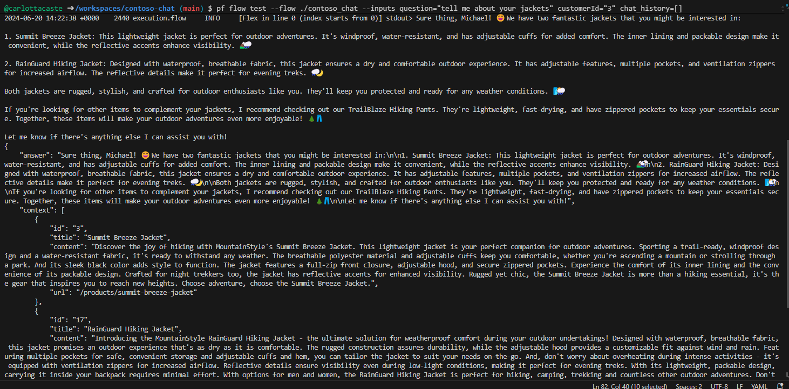

---
lab:
  title: 使用代码优先开发工具生成自定义 Copilot
---

# 使用代码优先开发工具生成自定义 Copilot

在本练习中，将克隆并部署 Azure Developer CLI 模板，该模板预配 AI 项目并将其[部署到 Azure AI Studio 上的联机终结点](https://learn.microsoft.com/azure/developer/azure-developer-cli/azure-ai-ml-endpoints?WT.mc_id=academic-140829-cacaste) 。 然后，以它为起点，使用 Azure AI 和代码优先体验生成自己的自定义 Copilot。

该练习大约需要 **90** 分钟。

## 开始之前

若要完成本练习，需要：

- 一个 GitHub 帐户，用于对项目存储库进行分叉并在 GitHub Codespaces 环境中对其进行测试。 [在 GitHub 上](https://github.com/)创建免费帐户。
- 用于激活语义排序器的 Azure AI 搜索的基本层。 详细了解 [AI 搜索的定价详细信息](https://azure.microsoft.com/pricing/details/search/)。
- 要部署三个 OpenAI 模型 （`gpt-35-turbo`、`gpt-4`、`text-embedding-ada-002`）。 为了能够部署模型，需要在具有足够配额的区域中创建 AI 中心。 详细了解[模型区域可用性](https://learn.microsoft.com/azure/ai-services/openai/concepts/models?WT.mc_id=academic-140829-cacaste#model-summary-table-and-region-availability)。

## 了解方案

要开始使用 Azure Developer CLI AI 项目模板，请导航到 [Azure Developer CLI 集合的 Azure AI 模板](https://learn.microsoft.com/collections/5pq0uompdgje8d/?WT.mc_id=academic-140829-cacaste)。 通过浏览集合，可以查找按技术和用例分组的多个项目，包括多模式和多代理项目示例、类似 Copilot 的项目以及集成不同框架和 Azure 服务的示例。

在本练习中，你将以**[使用 Azure AI Studio 和 PromptFlow (Python) 的 Contoso Chat Retail Copilot](https://aka.ms/contoso-retail-sample)** 项目模板作为起点。 此项目模板是一种代码优先体验，它使用 Prompty 和 PromptFlow 生成自定义 Copilot（聊天 AI），此 Copilot 可集成到名为 Contoso Outdoors 的虚构公司的零售网站（聊天 UI）中。


零售 Copilot 解决方案使用检索增强生成 (RAG) 模式对公司产品和客户数据进行响应。 客户可以询问零售聊天机器人有关公司产品目录的问题，还可以根据之前的购买情况获取建议。

选择集合中包含的项目链接会将你重定向到托管模板代码的 GitHub 存储库。 存储库中的 [README.md](https://github.com/Azure-Samples/contoso-chat/blob/main/README.md) 文件提供项目的详细说明，包括体系结构、先决条件和部署项目的步骤。


## 设置 GitHub Codespaces

本练习中将使用 [GitHub Codespaces](https://github.com/features/codespaces)，这是一项 GitHub 功能，只需单击一下即可直接从存储库启动预配置的云托管[开发容器](https://docs.github.com/codespaces/setting-up-your-project-for-codespaces/adding-a-dev-container-configuration/introduction-to-dev-containers)。 这样，无需设置本地开发环境即可快速开始编码，因为 Codespaces 已经预安装所有必要的工具和依赖项。

要初始化开发环境，请执行以下步骤：

1. 导航到 **contoso-chat** 存储库：`https://github.com/Azure-Samples/contoso-chat`
1. 选择 contoso-chat GitHub 存储库页面右上角的“**创建分支**”按钮，在 GitHub 帐户中创建存储库的副本。
1. 为存储库创建分支后，选择“**代码**”按钮，然后选择“**Codespaces**”。
1. 选择“**+**”按钮，在已创建分支的存储库的主分支上新建 Codespace。

    

1. 几秒钟后，你将被重定向到新的浏览器标签页，其中的 Codespaces 环境默认使用[附加的 Visual Studio Code 编辑器](https://code.visualstudio.com/docs/devcontainers/containers)进行设置。

## 将 VS Code 环境连接到 Azure

下一步是将开发环境与要在其中部署项目的 Azure 订阅连接起来。 首先，在 Codespaces 中运行的 VS Code 环境中打开新终端。

1. 首先，验证是否已安装[最新版本](https://github.com/Azure/azure-dev/releases/tag/azure-dev-cli_1.9.3)的 Azure Developer CLI。
    ```bash
    azd version
    ```

1. 接下来，从 VS Code 终端登录到 Azure 帐户。

    ```bash
    azd auth login 
    ```

## 为项目预配 Azure 资源

登录后，即可开始为订阅中的项目预配 Azure 资源。 可以在用于登录的同一 VS Code 终端中执行此操作。

1. 使用 azd 预配*和部署* AI 应用程序。

    ```bash
    azd up
    ```

1. 应看到以下提示。 使用以下指南做出响应：
    - **输入新的环境名称：***用于创建资源组名称*。
    - **选择要使用的 Azure 订阅**：*选择有权访问 Azure OpenAI 模型的订阅*。
    - **选择要使用的 Azure 位置**：*选择具有可用模型配额的位置*。

    > 使用[模型摘要表和区域可用性](https://learn.microsoft.com/en-us/azure/ai-services/openai/concepts/models?WT.mc_id=academic-140829-cacaste#model-summary-table-and-region-availability)查找所需的区域。 例如，可以使用 `sweden central` 作为 Azure 位置，因为它是大多数 Azure OpenAI 模型可用的区域。

## 使用 Azure 门户验证预配

使用 azd 预配和部署 AI 应用程序可能需要 10 分钟或更多时间才能完成。 可以通过以下方式跟踪进度：

- 在 [Azure 门户](https://ms.portal.azure.com/)中查看详细进度。 搜索与环境名称对应的资源组。 在边栏中选择“**部署**”选项，然后监视所创建资源的部署状态。
- 访问 [Azure AI Studio](https://ai.azure.com) 门户。 使用 Azure 帐户登录。 搜索与上述资源组对应的 AI 中心（可能需要刷新几次）。 选择列出的 AI 项目，然后在其边栏中选择“**部署**”以跟踪模型和聊天应用程序部署的状态。

让我们探索如何使用 Azure 门户验证资源的预配。

1. 在浏览器中，导航到 [Azure 门户](https://ms.portal.azure.com/)。
1. 登录并查找与前面输入的订阅和环境名称对应的资源组。 “**概述**”面板应如下所示：

    

1. 首先，验证是否已创建关键的 [Azure AI Studio 体系结构](https://learn.microsoft.com/azure/ai-studio/concepts/architecture)资源。 下图更详细地介绍了这些资源为 AI 应用程序提供的内容。

    - **Azure AI 中心**：顶级 Azure 资源。 为团队提供协作环境。
    - **Azure AI 项目**：中心的子级。 对用于业务流程、自定义的应用组件进行分组。
    - **Azure AI 服务**：管理模型终结点。

    

1. 接下来，让我们验证一下，我们是否已预配两个用于实现 [检索增强生成](https://learn.microsoft.com/azure/ai-studio/concepts/retrieval-augmented-generation)设计模式的关键资源，方法是存储产品和客户数据进行查询驱动的检索。

    - **搜索服务**：管理产品目录数据的搜索索引。
    - **Azure Cosmos DB 帐户**：为客户订单数据创建数据库。

1. 接下来，我们可以验证我们是否具有用于管理 AI 应用程序需求的支持资源：

    - **Application Insights**：支持对已部署应用程序的监视和遥测。
    - **容器注册表**：私下存储和管理项目中使用的 Docker 映像。
    - **密钥保管库**：安全地存储项目机密（密钥、凭据）。
    - **存储帐户**：存储与 AI 项目管理相关的数据（包括日志）。
    - **智能检测器预警规则**：Application Insights 异常检测器（针对请求）。

1. 最后但很重要的一点是，你会注意到类型为**机器学习联机部署**的新资源。 这是与已部署的 Azure AI 项目终结点（用于聊天 Copilot）相对应的资源。

## 使用 Azure AI Studio 验证部署

Azure 门户可帮助管理项目的基础 Azure 资源。 Azure AI Studio 门户可从模型选择到应用程序部署，以端到端方式帮助*生成和管理* AI 项目本身。 该 `azd up` 命令应已完成从预配所需模型到部署和托管 Copilot API 终结点以供使用的整个过程。 让我们验证应用程序是否按预期运行。

1. 访问 [Azure AI Studio](https://ai.azure.com/manage) 中的“**管理**”页，查看订阅中的所有 Azure AI 中心。
1. 选择资源组的中心以查看其中的所有 Azure AI 项目。
1. 在中心中选择默认 AI 项目，然后在左侧菜单中选择“**部署**”。
1. 在“**模型部署**”下，验证是否具有 Azure OpenAI 连接，包括以下部署：
    - **gpt-35-turbo**：用于聊天补全，形成核心聊天引擎。
    - **gpt-4**：用于聊天评估，特别是 AI 辅助流。
    - **text-embedding-ada-002**：用于查询矢量化和搜索。
1. 验证是否具有机器学习联机终结点，并具有以下功能：
    - **chat-model**：包含 *mloe-xxx* 终结点资源的聊天 AI 部署。

    

## 使用 Azure AI Studio 测试部署（在云端）

要验证已部署的助手是否正常工作，请使用 Azure AI Studio 中的内置测试操场功能。


1. 在 Azure AI Studio 的“**应用部署**”列表中，选择 **chat-deployment-xxxx** 部署。
1. 在已部署的聊天应用程序的“**详细信息**”页上，选择“**测试**”选项卡以获取测试界面。

    请注意，“**详细信息**”选项卡还具有 `Target URI` 和 `Key` 值，你可以将这些值用于其他前端应用程序（例如 Contoso Outdoor 网站），从而为实际用户交互集成此聊天助手。

1. 现在，使用以下测试“**输入**”测试助手部署：

    ```bash
    {"question": "tell me about your hiking shoes", "customerId": "2", "chat_history": []}
    ```

应在输出组件中获取有效的 JSON 响应，如下所示。


## 使用 Visual Studio Code 测试部署（本地）

**azd up** 命令不仅将应用程序预配并部署到 Azure，还会在 Visual Studio Code 中*配置本地环境*，以支持本地开发、测试和迭代。 让我们看看吧！

1. 首先，验证 VS Code 环境是否已正确设置。 在根文件夹中搜索 **config.json** 文件，并验证其是否定义了以下三个属性，并具有有效值。

    ```json
    {
        "subscription_id": "xxxxxxxxxxxxxxxx",
        "resource_group": "rg-xxxxxx",
        "workspace_name": "ai-project-xxxxxxx"
    }

    ```

1. 验证是否已在根文件夹中创建 **.env** 文件。 它应包含一个*已填充值*的环境变量列表。

    ```bash
    AZUREAI_HUB_NAME=
    AZUREAI_PROJECT_NAME=
    AZURE_CONTAINER_REGISTRY_ENDPOINT=
    AZURE_CONTAINER_REGISTRY_NAME=
    AZURE_COSMOS_NAME=
    AZURE_ENV_NAME=
    AZURE_KEY_VAULT_ENDPOINT=
    AZURE_KEY_VAULT_NAME=
    AZURE_LOCATION=
    AZURE_OPENAI_API_VERSION=
    AZURE_OPENAI_CHAT_DEPLOYMENT=
    AZURE_OPENAI_ENDPOINT=
    AZURE_OPENAI_NAME=
    AZURE_RESOURCE_GROUP=
    AZURE_SEARCH_ENDPOINT=
    AZURE_SEARCH_NAME=
    AZURE_SUBSCRIPTION_ID=
    AZURE_TENANT_ID=
    COSMOS_ENDPOINT=
    ```

1. 验证是否已 在开发环境中安装了 **Promptflow 工具**。

    ```bash
    pf version
    ```

1. 使用 **pf 流测试**工具在本地测试 **contoso_chat** 灵活流应用程序，并参考以下示例问题。 请注意用于传递输入的命令的语法：

    ```bash
    pf flow test --flow ./contoso_chat --inputs question="tell me about your jackets" customerId="3" chat_history=[]
    ```

你应该会收到类似以下内容的响应：



### 使用 Visual Studio Code 查看跟踪（本地）

1. 可以使用 `--ui` 标记跟踪执行详细信息，如下所示。

    ```bash
    pf flow test --flow ./contoso_chat --inputs question="tell me about your jackets" customerId="3" chat_history=[] --ui
    ```

此命令应在浏览器中（新选项卡中）启动一个**跟踪视图**，视图中的表格提供了有关该测试运行的概要详细信息，包括延迟和令牌使用情况。


1. 选择该记录以展开到更详细的跟踪视图，以便检查流从原始数据（输入、输出）到流的各个步骤和相关组件（例如，用于 LLM 的提示模板）的更详细的细节。


## 了解 Contoso Chat 代码库

Azure 后端已预配并准备就绪。 本地开发环境已设置并配置为使用 Azure 后端。 现在，只需开始修改内容以自定义和重新部署自己的应用程序版本。 让我们来快速了解代码库的结构。

> 这是存储库的一个**简化列表**，清楚起见，去除了一些文件和文件夹。

```bash
data/
    customer_info/  
        create-cosmos-db.ipynb      # Run notebook to upload data to Cosmos DB
        customer_info_1.json        # Example Customer info and orders file
        customer_info_2.json 
        ...
        ...
    product_info/   
        create-azure-search.ipynb   # Run notebook to index product data in AI Search
        products.csv                # Example Products data file

contoso_chat/                       # Main folder for application content
    ai_search.py                    # Search retrieval tool (for RAG design)
    chat.json                       # Example chat file (for Prompty template)
    chat.prompty                    # Chat asset (using Prompty format)
    chat_request.py                 # LLM request tool (for chat completion)
    flow.flex.yaml                  # Promptflow flex flow (define entry point)
    requirements.txt                # App dependencies (define runtime environment)

azure.yaml                          # Main configuration file for Azure Developer CLI  
infra/      
    ai.yaml                         # Define AI model deployments
    app/                            # Infrastructure-as-code config specific to app
    core/                           # Infrastructure-as-code config for core resources
    hooks/                          # Contains post-provisioning scripts
    main.bicep                      # Entry point for Bicep template used by azd
deployment/                         # ai.endpoint config files (named in azure.yaml)
    chat-deployment.yaml 
    chat-model.yaml  
    environment.yaml  

requirements.txt
```

如果要自定义代码：

- 如果要更改应用（在 `contoso_chat/` 中），只需运行 `azd deploy` 来将应用程序重新部署到先前预配的后端。 不需要额外的重新预配或手动干预步骤。
- 如果要更改资源（在 `infra/` 文件夹中），请运行 `azd up` 以重新预配并重新部署应用程序。 它应该会自动从 `.azure/` 中选取先前的配置值并对其进行修改。

## 可选：自定义和重新部署助手

现在可以构建自己的自定义助手了。 以下是可以探索的一些内容，以尝试进行构建。

请记得以下每个选项：

- 如果仅更改了应用代码，请使用 `azd deploy` 重新部署应用程序。
- 如果更改了资源配置，请使用 `azd up` 重新预配和重新部署应用程序。

### 自定义客户和订单历史记录数据

1. 查看 **data/customer_info** 下的示例数据，了解默认架构。
1. 浏览 **data/create-cosmos-db.ipynb** 笔记本，了解代码优先的数据更新方法。
1. **修改**示例数据并**运行**笔记本以更改默认的 Azure CosmosDB 数据库。
1. **重新部署**应用。 尝试使用测试问题验证是否返回新的客户数据。

### 自定义产品目录数据

1. 查看 **data/product_info/** 下的示例数据，了解默认架构。
1. 浏览 **create-azure-search.ipynb** 笔记本，了解用于索引更新的代码优先方法。
1. **修改**示例数据并**运行**笔记本以更改默认的 Azure AI 搜索索引。
1. **重新部署**应用。 尝试使用测试问题验证是否返回新产品数据。

### 自定义提示模板

1. 查看 **contoso_chat/chat.prompty** 文件，了解默认提示模板。
1. 查看 **contoso_chat/chat.json**，了解用于测试的示例数据架构。
1. **修改**模板（系统消息、安全、文档或说明）。
1. 根据需要**修改**示例数据。
1. **使用** Promptflow CLI 通过新的提示模板在本地测试流。
1. **安装并使用** Prompty 扩展以从头开始新建提示模板。

### 浏览评估和管道自动化

将通过 GitHub Actions 运行应用评估管道所使用的测试数据集替换为自己的数据。 测试数据集位于项目的**数据**文件夹中，采用 **.jsonl** 格式。

1. 将测试数据集文件替换为自己的数据。
1. 然后，将更改推送到已创建分支的存储库的主分支来运行评估管道。

    评估管道将自动运行，可以在存储库的“GitHub Actions”选项卡中查看结果。

1. 可以自定义评估管道，方法是：修改项目的 **.github/workflows** 文件夹中的 **evaluate.yaml** 文件，以及 **evaluations** 文件夹中的 **evaluations_chat.py** 脚本。

## 清理并删除 Azure 资源

此项目使用的模型和服务（例如 Azure AI 搜索）如果长期运行，可能会产生非同寻常的成本。 浏览完此 Azure AI AZD 模板后，应删除已创建的资源，以避免产生不必要的 Azure 成本。 可以在 VS Code 终端中运行以下命令来执行此操作：

```bash
azd down
```

这不仅颠倒预置和部署应用程序所采取的步骤，而且还需要采取额外的步骤来*清除*资源，否则这些资源可能会处于“软删除”状态，从而影响重用资源名称或回收模型配额的能力。 **此命令会在关闭期间提示你执行这些操作，因此请确保正确响应**。
