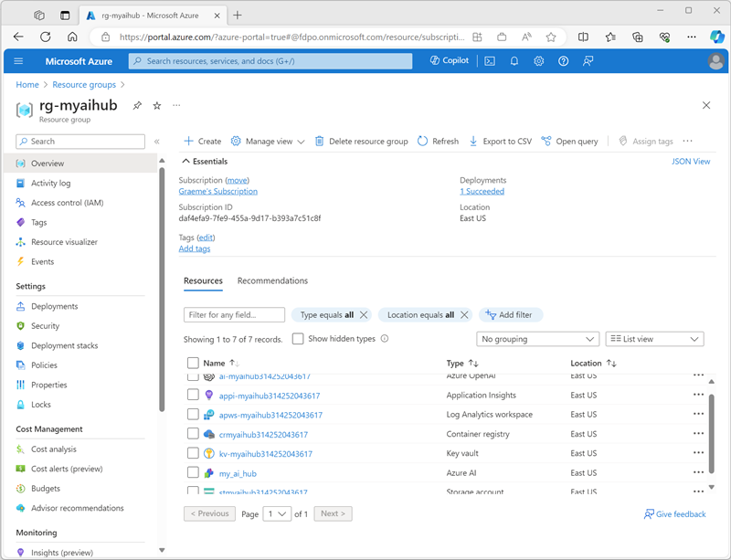
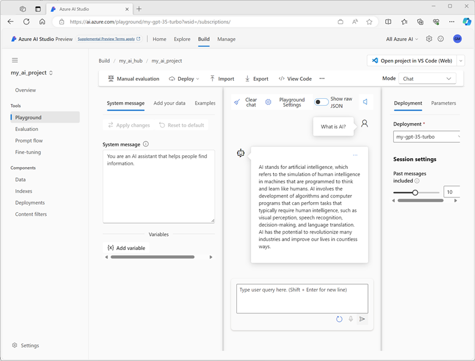

---
lab:
  title: 探索 Azure AI Studio
---

# 探索 Azure AI Studio

在本练习中，你将使用 Azure AI Studio 创建项目并探索生成式 AI 模型。

> **注意**：Azure AI Studio 在撰写本文时处于预览状态，目前正在积极开发中。 该服务的某些元素可能与本文所述不完全相同，并且一些功能可能无法按预期工作。

> 要完成此练习，你的 Azure 订阅必须获得批准才能访问 Azure OpenAI 服务。

此练习大约需要 **30** 分钟。

## 打开 Azure AI Studio

让我们首先查看 Azure AI Studio。

1. 在 Web 浏览器中，使用 Azure 凭据打开 [https://ai.azure.com](https://ai.azure.com) 并登录。 Azure AI Studio 的主页如下图所示：

    

1. 查看主页上的信息并查看每个选项卡，并指出浏览模型和功能、创建项目和管理资源的选项。

## 创建 Azure AI 中心

需要使用 Azure 订阅中的 Azure AI 中心来托管项目。 可以在创建项目时创建此资源，也可以提前预配它（这就是我们将在本练习中执行的操作）。

1. 在“管理”部分，选择“所有中心”，然后选择“+ 新建中心”。************ 使用以下设置创建新中心：
    - **中心名称**：唯一的名称**
    - **订阅**：Azure 订阅
    - 资源组****：创建具有唯一名称的新资源组，或选择现有资源组**
    - 位置****：从以下任何区域中进行随机选择******\*
        - 澳大利亚东部
        - 加拿大东部
        - 美国东部
        - 美国东部 2
        - 法国中部
        - 日本东部
        - 美国中北部
        - 瑞典中部
        - 瑞士北部
        - 英国南部
    - **连接 Azure AI 服务或 Azure OpenAI**：选择创建新的 AI 服务或使用现有 AI 服务
    - **连接 Azure AI 搜索**：跳过连接

    > \* Azure OpenAI 资源受区域配额限制在租户级别。 列出的区域包括本练习中使用的模型类型的默认配额。 在与其他用户共享租户的情况下，随机选择一个区域可以降低单个区域达到配额限制的风险。 如果稍后在练习中达到配额限制，你可能需要在不同的区域中创建另一个资源。

    创建 Azure AI 中心后，它应如下图所示：

    

1. 打开新的浏览器标签页（Azure AI Studio 标签页保持打开状态），浏览到 Azure 门户 ([https://portal.azure.com](https://portal.azure.com?azure-portal=true))，如果系统提示，请使用 Azure 凭据登录。
1. 浏览到在其中创建了 Azure AI 中心的资源组，并查看已创建的 Azure 资源。

    

1. 返回到 Azure AI Studio 浏览器标签页。
1. 在 Azure AI 中心页面左侧的窗格中查看每个页面，并记下可以创建和管理的项目。 在“连接”页上，观察已创建的与 Azure OpenAI 资源的连接****，该资源是你使用名为 **Default_AzureOpenAI** 的 Azure AI 中心创建的。

## 创建项目

Azure AI 中心会提供协作式工作区，可在其中定义一个或多个 *项目*。 让我们在 Azure AI 中心中创建一个项目。

1. 在 Azure AI Studio 的“生成”页上，选择“+ 新建项目”********。 然后，在“创建新项目”向导中，使用以下设置创建项目****：
    - 项目名称****：项目的唯一名称**
    - **中心**：*你的 AI 中心*
1. 等待创建项目。 准备就绪后，它应如下图所示：

    

1. 查看左侧窗格中的页面，展开每个部分，并记下可执行的任务以及可在项目中管理的资源。

## 部署和测试模型

可以使用项目基于生成式 AI 模型创建复杂的 AI 解决方案。 全面探索 Azure AI Studio 中提供的所有开发选项超出了本练习的范围，但我们将探索一些在项目中处理模型所使用的基本方法。

1. 在项目左侧的窗格中，在“组件”部分中，选择“部署”页********。
1. 在“部署”页上，选择“+ 创建”并创建实时终结点部署********。
1. 在“选择模型”列表中，选择 gpt-35-turbo 模型并确认选择********。 然后使用以下设置部署模型：
    - 部署名称****：模型部署的唯一名称**
    - 模型：gpt-35-turbo
    - **模型版本**：*选择默认版本*
    - **高级选项**：
        - **内容筛选器**：默认
        - **部署类型**：标准
        - **每分钟令牌数速率限制（数千个）**：5K

    > **注意**：减少 TPM 有助于避免过度使用正在使用的订阅中可用的配额。 5,000 TPM 对本练习中使用的数据是足够的。

1. 部署模型后，在左侧窗格的“工具”部分，选择“操场”页********。
1. 在“操场”页中，确保在“配置”部分选择了模型部署********。 然后，在“聊天会话”部分中，输入查询内容，例如“什么是 AI？”并查看答复******：

    

## 清理

如果已完成 Azure AI Studio 的探索，则应删除在本练习中创建的资源，以避免产生不必要的 Azure 成本。

1. 返回到包含 Azure 门户的浏览器标签页（或在新的浏览器标签页中重新打开 [Azure 门户](https://portal.azure.com?azure-portal=true) ），查看在其中部署了本练习中使用的资源的资源组的内容。
1. 在工具栏中，选择“删除资源组”****。
1. 输入资源组名称，并确认要删除该资源组。
